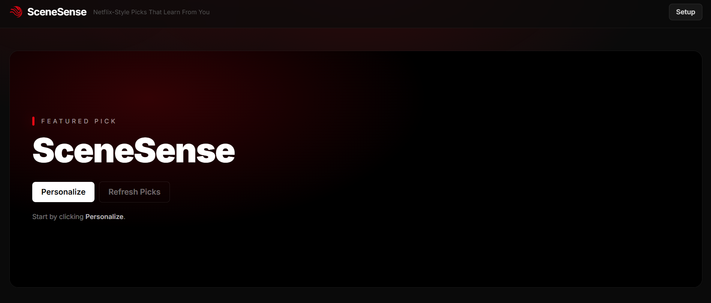
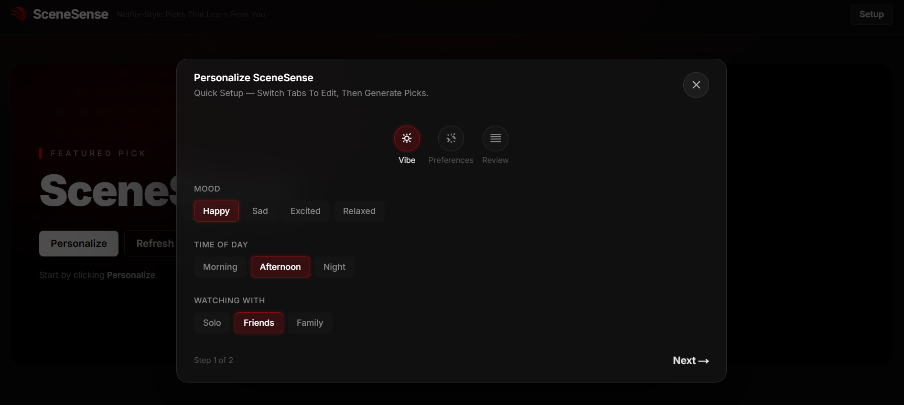
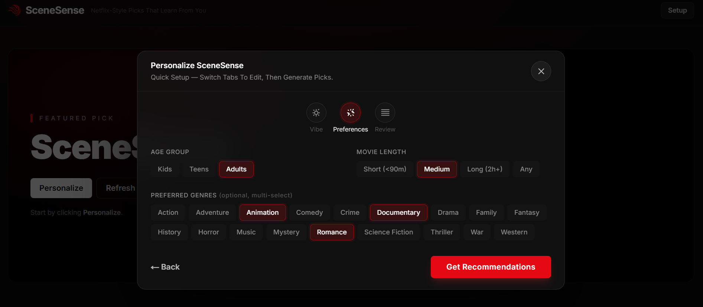
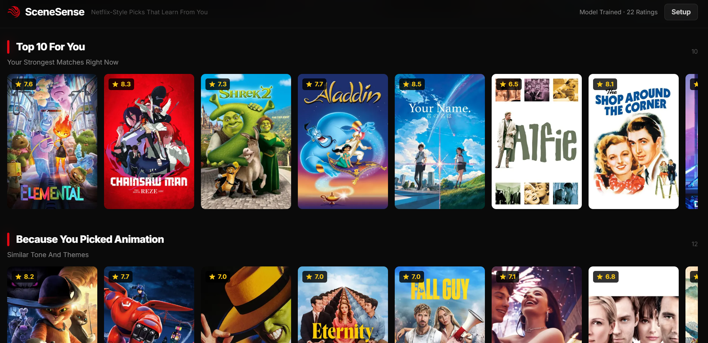
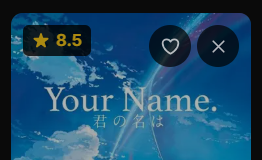
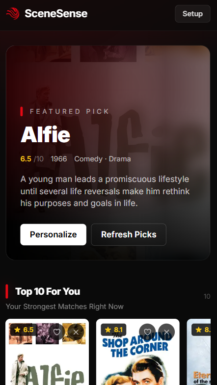

# SceneSense — ML Movie Recommender

SceneSense is a movie recommendation app built to help you find something you’ll actually want to watch, faster. Instead of browsing endlessly, you pick your current vibe (mood, time of day, and who you’re watching with) plus a few optional preferences like genres, age group, and movie length — and SceneSense generates a set of picks in a clean, Netflix-style layout.

As you rate movies with Like / Not for me, SceneSense adapts to your taste over time so the recommendations keep getting better.

**Live Demo:** [scenesense.vercel.app](https://scenesense.vercel.app)

<p align="center">
  
  <br>
  <b>Figure 1: SceneSense Preview</b>
</p>

---

## Features

### 1. Personalize Wizard (2-step setup)
- Quick setup modal that guides you through **Vibe → Preferences**
- **Vibe**: pick mood, time of day, and who you’re watching with
- **Preferences**: age group, movie length (short/medium/long/any), and optional multi-select genres
- “Get Recommendations” generates a full set of picks and closes into the results view

<table align="center">
  <tr>
    <td align="center">
      <br>
      <b>Figure 1: Personalize Wizard</b>
    </td>
    <td align="center">
      <br>
      <b>Figure 2: Another View</b>
    </td>
  </tr>
</table>

### 2. Netflix-style Results (featured hero + rows)
- Featured hero banner shows your top match with title, year, rating, and overview
- Horizontal “row” rails with smooth scrolling + hover arrows
- Built-in sections (based on the returned recommendations):
  - **Top 10 For You**
  - **More Like This** (or “Because you picked \<genre\>”)
  - **Hidden Gems**
  - **Highly Rated**
- Skeleton loading state while recommendations are fetched

<p align="center">
  
  <br>
  <b>Figure 3: Netflix-style Results Rows</b>
</p>

### 3. Feedback Training (Like / Not for me)
- Per-movie feedback buttons: **Like** (green) and **Not for me** (red)
- Sends feedback to the backend (`POST /feedback`) along with your current context selections
- Feedback is persisted locally in SQLite (`backend/feedback.db`)
- The backend retrains the personalization model periodically (every 5 feedback entries)

<p align="center">
  
  <br>
  <b>Figure 4: Movie Card Feedback</b>
</p>

### 4. Mobile Responsive UI
- Fully responsive layout for mobile, tablet, and desktop breakpoints
- Touch-friendly horizontal rows with swipe/scroll support
- Setup wizard and controls scale cleanly on smaller screens

<p align="center">
  
  <br>
  <b>Figure 5: Mobile Responsive UI</b>
</p>

---

## Prerequisites

| Tool    | Version  |
| ------- | -------- |
| Python  | 3.10+ (tested with 3.12) |
| Node.js | 18+ (recommended 20.19+ to avoid engine warnings) |
| npm     | 9+       |

You also need a free **TMDB API key**. Sign up at `https://www.themoviedb.org/settings/api`.

---

## Project Structure

```
SceneSense/
├── backend/
│   ├── main.py              # FastAPI app & endpoints (/recommend, /feedback, /health)
│   ├── dataset_loader.py    # TMDB data fetching (500 movies) + enrichment (runtime, genres)
│   ├── ml_model.py          # TF-IDF + SGDClassifier hybrid model
│   ├── recommender.py       # Filtering + ranking + hybrid scoring
│   ├── feedback_store.py    # SQLite storage for user feedback
│   ├── feedback.db          # Auto-created local SQLite database (after first run)
│   ├── requirements.txt     # Python dependencies
│   └── .env.example         # Environment variable template
├── frontend/
│   ├── src/
│   │   ├── app/
│   │   │   ├── layout.js    # Root layout
│   │   │   ├── page.js      # Filters + results grid (cineby.gd-inspired UI)
│   │   │   ├── globals.css  # Tailwind CSS entry
│   │   │   └── api/
│   │   │       └── recommend/
│   │   │           └── route.js  # API proxy to backend
│   │   └── components/
│   │       ├── ContextSelector.js
│   │       ├── GenreSelector.js
│   │       └── MovieCard.js
│   ├── package.json
│   ├── next.config.mjs
│   └── .env.local.example
└── README.md
```

---

## Quick Start

### 1. Backend

```bash
cd backend

# Create and activate a virtual environment (recommended)
python -m venv .venv
# Windows
.\.venv\Scripts\activate

# Install dependencies
pip install -r requirements.txt

# Set your TMDB API key
# Copy .env template and add your key
# (Windows PowerShell)
Copy-Item .env.example .env
# Edit .env and add your key: TMDB_API_KEY=your_key_here

# Start the server
uvicorn main:app --reload --port 8000
```

The API will be available at `http://localhost:8000`.

On startup, it fetches **up to ~500 popular movies** from TMDB and caches them **in memory** (the exact count can vary slightly based on TMDB results/filters). It also builds the **TF‑IDF matrix** at startup. This initial load can take **a minute or two** because it also fetches runtime details per movie.

**Endpoints:**

| Method | Path         | Description |
| ------ | ------------ | ----------- |
| GET    | `/health`    | Health check + movie count + ML status |
| POST   | `/recommend` | Get recommendations |
| POST   | `/feedback`  | Store like/dislike feedback (triggers model retrain periodically) |

**POST `/recommend` body:**

```json
{
  "mood": "happy",
  "time_of_day": "night",
  "company": "friends",
  "age_group": "adults",
  "genres": ["Action", "Science Fiction"],
  "length_pref": "any",
  "n": 12
}
```

### 2. Frontend

```bash
cd frontend

# Install dependencies
npm install

# Set the backend URL
# (Windows PowerShell)
Copy-Item .env.local.example .env.local

# Start the dev server
npm run dev
```

Open `http://localhost:3000` in your browser.

---

## Environment Variables

### Backend (`backend/.env`)

| Variable       | Required | Description                          |
| -------------- | -------- | ------------------------------------ |
| `TMDB_API_KEY` | Yes      | Your TMDB v3 API key                 |
| `CORS_ORIGINS` | No       | Comma-separated allowed origins (`*` default) |

### Frontend (`frontend/.env.local`)

| Variable      | Required | Description                       |
| ------------- | -------- | --------------------------------- |
| `BACKEND_URL` | No       | FastAPI URL (default `http://localhost:8000`) |

---

## How It Works

### Data loading (TMDB)
On backend startup, `dataset_loader.py` fetches **25 pages × 20 movies/page = up to ~500 movies** from TMDB Discover (sorted by popularity). It then fetches runtime per movie and stores everything in an in-memory cache.

### Recommendation (hybrid ML)
Recommendations use two ML stages:

- **Stage A: TF‑IDF similarity (works immediately)**  
  `ml_model.py` builds a TF‑IDF matrix from movie genres + descriptions and uses cosine similarity between your context profile and all movies.

- **Stage B: Personalized classifier (learns from you)**  
  When you click **Like** or **Not for me**, the app stores feedback in a local SQLite DB (`backend/feedback.db`).  
  After enough feedback (and periodically thereafter), the backend trains an **SGDClassifier** to predict the probability you’ll like each movie given:
  - movie TF‑IDF features
  - your selected context (mood/time/company/age/length + selected genres)

Final ranking blends **content similarity + learned preference score + a small TMDB rating bonus**.

### Constraints / filters
`recommender.py` also applies practical filters:
- **Kids** excludes certain genres (e.g. horror, war, etc.)
- **Length preference** filters by runtime buckets
- **Genre preferences** add a score boost (stronger matching)

### API proxy (frontend)
The Next.js frontend proxies requests through:
- `frontend/src/app/api/recommend/route.js` → backend `/recommend`
- `frontend/src/app/api/feedback/route.js` → backend `/feedback`

---

## Deployment

### Frontend → Vercel

1. Push the repo to GitHub.
2. Import the project in [Vercel](https://vercel.com).
3. Set the **Root Directory** to `frontend`.
4. Add the environment variable `BACKEND_URL` pointing to your deployed backend.
5. Deploy.

### Backend → Railway / Render / Fly.io

**Railway (example):**

1. Create a new project, connect your repo.
2. Set the **Root Directory** to `backend`.
3. Set the **Start Command** to `uvicorn main:app --host 0.0.0.0 --port $PORT`.
4. Add the `TMDB_API_KEY` environment variable.
5. Deploy and copy the public URL — use it as `BACKEND_URL` in the frontend.

---

## Notes

- **Where feedback is stored**: `backend/feedback.db` (SQLite file created automatically).  
  To reset personalization, stop the backend and delete `backend/feedback.db`.
- **More than 500 movies**: increase the `pages=` argument in `backend/main.py` when calling `load_movies(...)` (tradeoff: slower startup + more TMDB requests).

## License

MIT
